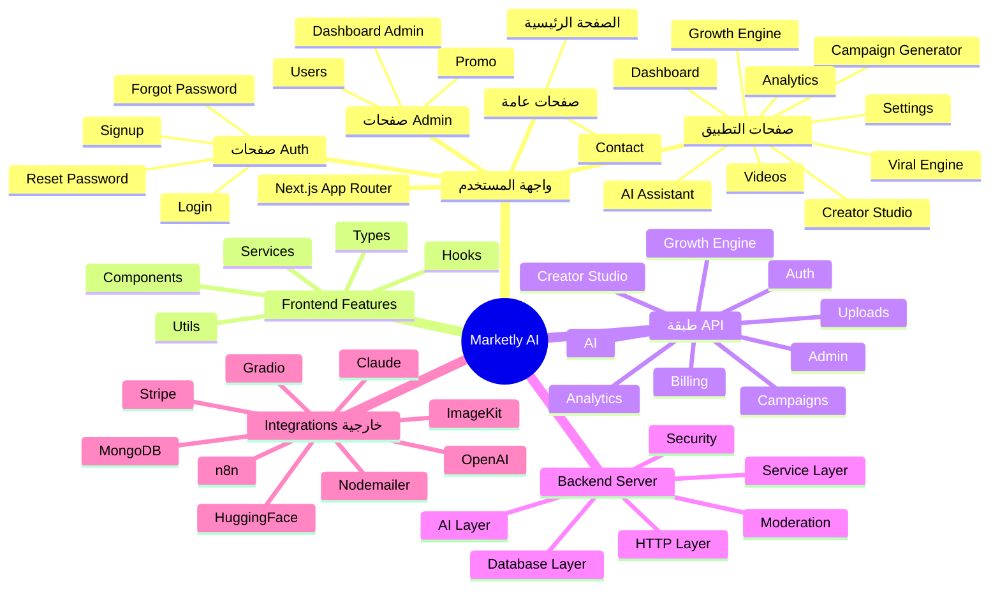
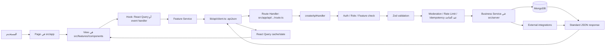
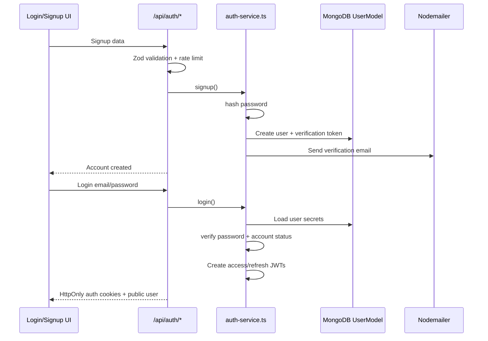
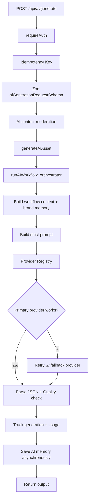
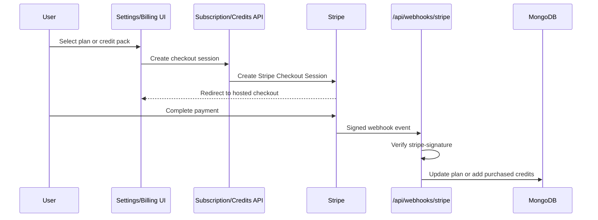

<div dir="rtl" align="right">

# خريطة ذهنية لفلو الكود والملفات — Marketly AI

> استخدم الخريطة بهذا الترتيب: ابدأ من **صفحة المستخدم**، ثم الـ **Feature**، ثم الـ **API route**، ثم الـ **Service**، ثم قاعدة البيانات أو أي خدمة خارجية. لا يلزم حفظ كل الملفات؛ افهم مسؤولية كل طبقة.

## 1) الخريطة الذهنية الرئيسية



## 2) خريطة المجلدات ومسؤولياتها

```text
src/
│
├── app/                         ← Next.js routes وlayouts وAPI endpoints
│   ├── page.tsx                 ← Landing page (/)
│   ├── layout.tsx               ← Root layout: fonts, providers, theme/language init
│   ├── providers.tsx            ← React Query + Theme + Translation + Tooltip providers
│   ├── globals.css              ← global styles وTailwind variables
│   ├── middleware.ts            ← حماية صفحات الواجهة + security headers
│   │
│   ├── (auth)/                  ← صفحات غير مسجل الدخول
│   │   ├── login/
│   │   ├── signup/
│   │   ├── forgot-password/
│   │   ├── reset-password/
│   │   └── verify-email/
│   │
│   ├── (app)/                   ← صفحات المنتج بعد تسجيل الدخول
│   │   ├── dashboard/
│   │   ├── ai-assistant/
│   │   ├── analytics/
│   │   ├── campaign-generator/
│   │   ├── creator-studio/
│   │   ├── growth-engine/
│   │   ├── images/
│   │   ├── marketing-strategy/
│   │   ├── settings/
│   │   ├── videos/
│   │   └── viral-engine/
│   │
│   ├── (admin)/admin/           ← لوحة الإدارة والمستخدمون والعروض
│   ├── contact/                 ← Contact page + client form
│   └── api/                     ← 80 Route Handlers تقريبًا
│
├── features/                    ← كل feature لها UI logic مستقل
│   ├── auth/
│   ├── dashboard/
│   ├── creator-studio/
│   ├── campaign-generator/
│   ├── growth-engine/
│   ├── analytics/
│   ├── ai-assistant/
│   ├── video-generator/
│   ├── viral-engine/
│   ├── marketing-strategy/
│   ├── storyboard/
│   ├── billing/
│   ├── landing/
│   └── settings/
│
├── components/                  ← مكونات مشتركة لا تخص feature واحدة
│   ├── ui/                      ← Button, Input, Dialog, Table, Tabs ...
│   ├── layout/                  ← AppShell, Sidebar, Topbar, PageShell
│   ├── shared/                  ← Cards, Charts, Upload, Empty/Error states
│   └── theme/                   ← Theme provider/toggle
│
├── lib/                         ← utilities مشتركة بين frontend/server حيث يلزم
│   ├── api/                     ← fetch client وGradio client
│   ├── constants/               ← navigation وapplication constants
│   ├── i18n/                    ← translations وuseTranslation
│   └── services/                ← AI factory/providers وstoryboard generator
│
├── server/                      ← backend business logic
│   ├── http/                    ← API handler, responses, validation, subscription checks
│   ├── security/                ← JWT, cookies, auth guard, rate limit, uploads, sanitize
│   ├── database/                ← Mongo connection + models + schemas
│   ├── services/                ← auth, dashboard, analytics, mail, upload, billing ...
│   ├── ai/                      ← AI workflows, providers, prompt, memory, retry, tracking
│   ├── creator-studio/          ← image generation pipeline
│   ├── campaign-generator/      ← campaign plan + creative generation
│   ├── growth-engine/           ← n8n client + project repository/service
│   ├── video-generator/         ← video generation business logic
│   ├── marketing-intelligence/  ← strategy, recommendations, analytics engine
│   ├── moderation/              ← AI moderation wrapper
│   ├── schemas/                 ← Zod request schemas
│   ├── errors/                  ← ApiError normalization
│   └── logging/                 ← structured logger
│
├── store/                       ← Zustand state (`ui-store.ts`)
└── types/                       ← types عامة مشتركة
```

## 3) الـ Universal Request Flow

هذا هو الفلو الذي ينطبق على معظم وظائف التطبيق:



### كيف تقرأ هذا الفلو في الكود؟

مثال Dashboard:

```text
src/app/(app)/dashboard/page.tsx
  → src/features/dashboard/components/dashboard-view.tsx
  → src/features/dashboard/hooks/use-dashboard.ts
  → src/features/dashboard/services/index.ts
  → src/lib/api/client.ts
  → src/app/api/dashboard/summary/route.ts
  → src/server/services/dashboard-service.ts
  → MongoDB Models
```

## 4) طبقة الـ API: خريطة endpoints

```text
src/app/api/
│
├── auth/                        ← signup, login, logout, me, refresh, reset, verify, OAuth
│   ├── signup/route.ts
│   ├── login/route.ts
│   ├── logout/route.ts
│   ├── me/route.ts
│   ├── refresh/route.ts
│   ├── forgot-password/route.ts
│   ├── reset-password/route.ts
│   ├── verify-email/route.ts
│   └── oauth/google|github/...  ← redirect/callback OAuth flows
│
├── dashboard/                   ← summary, generations, download
├── ai/                          ← generic generate, memory, personalize
├── ai-assistant/                ← chat + sessions + cleanup
├── assistant/                   ← chat history endpoints
├── creator-studio/              ← upload, generate, retry, history, favorites, download
├── campaign-generator/          ← upload, generate, hooks, captions, creatives, analytics
├── campaigns/ وcampaign/[id]/   ← campaign read/update/regenerate
├── growth-engine/               ← create/read Growth Project
├── video-generator/             ← generate, status, progress, history, export
├── analytics/                   ← events, overview, reports, insights, recommendations, analyze
├── viral-engine/                ← generate/read viral result
├── marketing-strategy/          ← generate strategy
├── generate-ad|campaign|storyboard/ ← generation endpoints إضافية
├── brand/                       ← brand profile/context
├── uploads/ وparse-pdf/         ← file handling
├── subscription/ وcredits/ وplans/ ← billing access
├── webhooks/stripe/             ← Stripe server-to-server callback
├── admin/                       ← dashboard, users, analytics, promotions
├── contact/                     ← contact form/email
└── users/ping/                  ← user utility endpoint
```

## 5) Auth Flow بالتفصيل



### ملفات الـ Auth المهمة

```text
UI:      src/features/auth/
Routes:  src/app/api/auth/
Service: src/server/services/auth-service.ts
Guard:   src/server/security/auth-guard.ts
JWT:     src/server/security/jwt.ts
Cookies: src/server/security/cookies.ts
Model:   src/server/database/models/user.model.ts
```

## 6) Generic AI Generation Flow



### ملفات AI المهمة

```text
Route:        src/app/api/ai/generate/route.ts
Service:      src/server/services/ai-generation-service.ts
Orchestrator: src/server/ai/orchestrator.ts
Providers:    src/server/ai/providers/
Registry:     src/server/ai/providers/registry.ts
Retry:        src/server/ai/pipelines/retry.ts
Prompts:      src/server/ai/prompts/
Workflows:    src/server/ai/workflows/
Memory:       src/server/ai/memory/
Tracking:     src/server/ai/tracking/
```

## 7) Creator Studio Flow

```mermaid
flowchart TD
  A[Upload Product/Reference Image] --> B[/api/creator-studio/upload]
  B --> C[Validate type/size/file header]
  C --> D[Optimize and upload to ImageKit]
  D --> E[Return asset URL]
  E --> F[POST /api/creator-studio/generate]
  F --> G[Auth + Idempotency + Zod + Moderation]
  G --> H[Deduct credits: variations × 2]
  H --> I[Load brand memory]
  I --> J[Build Flux image prompt]
  J --> K[Gradio / image provider generation]
  K --> L[Save resulting assets to ImageKit]
  L --> M[Persist GeneratedContent in MongoDB]
  M --> N[Return generated images]
```

```text
UI:       src/features/creator-studio/
Routes:   src/app/api/creator-studio/
Service:  src/server/creator-studio/service.ts
Pipeline: src/server/creator-studio/image-pipeline.ts
Storage:  src/server/services/imagekit-service.ts
Credits:  src/server/services/billing/credits.service.ts
Model:    src/server/database/models/generated-content.model.ts
```

## 8) Campaign Generator Flow

```mermaid
flowchart TD
  A[Brief + product + audience + platforms] --> B[/api/campaign-generator/generate]
  B --> C[Auth + Zod + Moderation]
  C --> D[Load brand memory]
  D --> E[Build campaign prompt]
  E --> F[Mistral generates JSON campaign plan]
  F --> G[Validate output with campaignPlanSchema]
  G --> H[Sanitize: deduplicate + claim-safe text]
  H --> I[Create angles, hooks, captions, CTAs]
  I --> J[Generate creative for every angle in parallel]
  J --> K[Build estimated analytics]
  K --> L[Return CampaignRecord]
```

```text
UI:          src/features/campaign-generator/
Routes:      src/app/api/campaign-generator/
Service:     src/server/campaign-generator/service.ts
LLM:         src/server/campaign-generator/mistral-service.ts
Creatives:   src/server/campaign-generator/creative-service.ts
Validation:  src/server/campaign-generator/schemas.ts
```

## 9) Growth Engine Flow

```mermaid
flowchart TD
  A[Brand + audience + industry + goal + brief] --> B[/api/growth-engine]
  B --> C[requireFeature: growthEngine]
  C --> D[Parse/validate multipart form]
  D --> E{Product image?}
  E -- نعم --> F[Validate + upload to ImageKit]
  E -- لا --> G[Continue]
  F --> G
  G --> H[Deduct 10 credits]
  H --> I[Create draft GrowthProject in MongoDB]
  I --> J[Call n8n webhook]
  J --> K[n8n performs long-running workflow]
  K --> L[Fetch generated/updated project]
  L --> M[Return project to UI]
  J -. failure .-> N[Save draft with error]
```

```text
UI:         src/features/growth-engine/
Route:      src/app/api/growth-engine/route.ts
Service:    src/server/growth-engine/service.ts
n8n client: src/server/growth-engine/n8n-client.ts
Repository: src/server/growth-engine/repository.ts
Schema:     src/server/growth-engine/schemas.ts
Model:      src/server/database/models/growth-project.model.ts
```

## 10) Billing وStripe Flow



```text
Routes:       src/app/api/subscription/, credits/, plans/
Webhook:      src/app/api/webhooks/stripe/route.ts
Stripe:       src/server/services/billing/stripe.service.ts
Subscription: src/server/services/billing/subscription.service.ts
Credits:      src/server/services/billing/credits.service.ts
```

## 11) Authorization Flow

```text
UI middleware
  └─ هل يوجد access أو refresh cookie؟
      ├─ لا → redirect إلى /login
      └─ نعم → السماح بعرض الصفحة

Protected API
  └─ requireAuth أو requireUser
      ├─ قراءة Bearer token أو access cookie
      ├─ Verify JWT
      ├─ التحقق أن user موجود وغير suspended/deleted
      ├─ عند admin route → requireAdmin
      └─ عند paid feature → requireFeature
          └─ التحقق من user.features[feature]
```

## 12) طبقات الحماية ومعالجة الأخطاء

```text
Request
  → middleware: redirect/security headers
  → createApiHandler: request ID + centralized error conversion
  → rate limit
  → JWT/role/subscription check
  → Zod validation
  → input sanitization/upload validation
  → AI moderation عند endpoints الذكية
  → service execution + timeout/retry عند الحاجة
  → jsonSuccess أو jsonError response موحد
```

## 13) Design Patterns — أين توجد في الملفات؟

| النمط | أين يظهر؟ | فائدته |
|---|---|---|
| Feature-based architecture | `src/features/*` | فصل كل business feature عن الأخرى |
| Service Layer | `src/server/services/*` و`src/server/<feature>/*` | إبقاء routes قصيرة وقابلة للاختبار |
| Provider Registry / Strategy | `src/server/ai/providers/registry.ts` | تبديل AI provider بسهولة |
| Factory | `src/lib/services/ai-factory.ts` | اختيار implementation مناسب للـ AI |
| Adapter | Gradio/ImageKit/Stripe services | توحيد التعامل مع external APIs |
| Repository-like | `src/server/growth-engine/repository.ts` | فصل database queries عن service logic |
| Middleware | `src/middleware.ts` | حماية صفحات وإضافة headers |
| DTO/Schema Validation | `src/server/schemas/*` وfeature schemas | منع input غير صالح |
| Retry/Fallback | `src/server/ai/pipelines/retry.ts` | resilience عند فشل provider |

## 14) إجابة عملية عند فتح أي ملف في المناقشة

اسأل نفسك هذه الأسئلة بالترتيب:

1. هل هذا **Page** أم **Component** أم **Hook** أم **Route** أم **Service** أم **Model**؟
2. من الذي يستدعيه؟
3. هل هو Frontend أم Backend أم Integration؟
4. ما الـ input الذي يستقبله؟ وهل يتم validation له؟
5. هل يحتاج authentication أو role أو subscription feature؟
6. ما الـ database model أو external service الذي يستدعيه؟
7. ما الـ response أو side effect الذي ينتج عنه؟

الصيغة الجاهزة لأي feature:

> المستخدم يتفاعل مع View داخل feature، والـhook أو service يرسل request للـAPI. الـRoute Handler يتحقق من المستخدم والـinput ثم يمرر التنفيذ إلى Service Layer. الـService ينفذ business logic، ويتعامل مع MongoDB أو AI/Stripe/n8n/ImageKit، ثم يرجع response موحدًا للواجهة.

</div>
