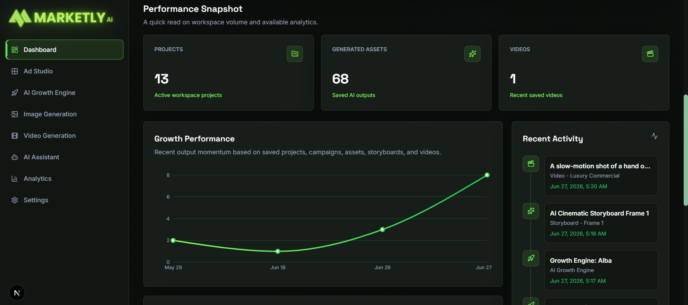

<div align="center">
  

  **The Next-Generation AI-Powered Marketing OS for Startups and Agencies.**

  [](https://opensource.org/licenses/MIT)
  [](https://nextjs.org/)
  [](https://reactjs.org/)
  [](https://www.typescriptlang.org/)
  [](https://tailwindcss.com/)
  [](https://nodejs.org/)
  [](#)
  [](#contributing)

</div>

---

## 🚀 Project Overview

**Marketly AI** is an all-in-one, intelligent Marketing Operating System designed to automate and scale digital marketing efforts. It bridges the gap between creative ideation and data-driven execution. 

### Why it exists
Modern marketing requires juggling multiple tools for ad creation, video generation, analytics, and strategy. Marketly AI unifies these workflows into a single, cohesive platform, leveraging cutting-edge Generative AI and workflow automation to save thousands of hours of manual work.

### The Problem it Solves
- Overwhelming tool fatigue in the marketing stack.
- High costs and slow turnaround times for video and image ad creation.
- Disconnected analytics and strategy planning.
- Difficulty in detecting and acting on viral social trends in real-time.

### Target Users
- **Growth Hackers & Marketers** looking to scale their creative output.
- **SaaS Founders** wanting an automated marketing department.
- **Agencies** managing multiple brands and campaigns.

### High-Level Architecture
Marketly AI is a full-stack Next.js application built on a decoupled architecture. The frontend uses React 19, Tailwind CSS 4, and Framer Motion for a premium UX. The backend relies on Next.js API Routes (Serverless) communicating with a MongoDB database. Heavy, asynchronous processing (like Apify scraping and complex AI chains) is offloaded to n8n Webhooks, which then ping the application back when data is ready.

---

## 📸 Screenshots

<details>
<summary><b>🖼️ Click to expand screenshots</b></summary>

### Dashboard
<div align="center">
  
</div>

### AI Growth Engine
<div align="center">
  *Placeholder for AI Growth Engine*
</div>

### Image Generator (Creator Studio)
<div align="center">
  *Placeholder for Image Generator*
</div>

### Video Generator
<div align="center">
  *Placeholder for Video Generator*
</div>

### Analytics
<div align="center">
  *Placeholder for Analytics*
</div>

### Viral Engine
<div align="center">
  *Placeholder for Viral Engine*
</div>

### AI Assistant
<div align="center">
  *Placeholder for AI Assistant*
</div>

### Settings
<div align="center">
  *Placeholder for Settings*
</div>

</details>

---

## ✨ Features

### 🔐 Authentication
- **Secure Login & Registration** (Email/Password)
- **OAuth Integration** (Google Login)
- **JWT-based Sessions** with automatic token refreshing
- **Role-based Access Control** (Admin vs User)

### 🤖 AI Capabilities
- **Image Generation:** Text-to-image ad generation using OpenRouter / HuggingFace.
- **Video Generation:** AI Video generation utilizing Wan I2V models via Gradio Client.
- **Storyboard Generator:** Converts marketing scripts into cinematic frame-by-frame storyboards.
- **AI Assistant:** Context-aware chat assistant for marketing advice.
- **Campaign Generator:** Automatically plans full-funnel marketing campaigns.

### 📊 Analytics
- **KPI Dashboard:** Real-time metrics (CTR, Engagement, Reach).
- **Interactive Charts:** Powered by Recharts for visual data representation.
- **Automated Reports:** AI-driven insights summarizing performance.
- **Actionable Recommendations:** Predictive suggestions to improve ROI.

### 🔥 Viral Engine
- **Social Analysis:** Scrapes and analyzes trending content across platforms.
- **Competitor Analysis:** Tracks competitor Media Impact Value (MIV).
- **Viral Hooks:** Generates high-converting hooks based on current trends.
- **UGC Ideas:** Automatically ideates User Generated Content strategies.

### 🔌 Integrations
- **n8n:** Orchestrates complex, long-running webhooks and automation pipelines.
- **Apify:** Powers the data scraping for the Viral and Growth engines.
- **HuggingFace & OpenRouter:** Drives the LLM and Generative AI features.
- **Stripe:** Manages subscription billing and tier access.
- **MongoDB:** Robust NoSQL database for flexible data storage.

---

## 🛠️ Tech Stack

| Category | Technology |
|---|---|
| **Frontend Framework** | Next.js 15.5 (App Router), React 19 |
| **Styling** | Tailwind CSS v4, Tailwind Merge, CVA |
| **State Management** | Zustand, React Query (TanStack) |
| **UI Components** | Radix UI (Headless primitives) |
| **Animations** | Framer Motion |
| **Icons** | Lucide React |
| **Charts & Data Viz** | Recharts |
| **Forms & Validation** | React Hook Form, Zod |
| **Backend / API Layer** | Next.js API Routes (Serverless) |
| **Database** | MongoDB (via Mongoose) |
| **Authentication** | Custom JWT Auth & OAuth |
| **AI Models** | OpenAI, Anthropic, HuggingFace Inference, Wan I2V |
| **Workflow Automation**| n8n Webhooks |
| **Web Scraping** | Apify |
| **Payments** | Stripe |

---

## 🏗️ Project Architecture

1. **Frontend:** Server Components (RSC) and highly interactive Client Components built with React 19.
2. **Backend / API Layer:** Next.js Route Handlers securely wrap third-party API calls, interact with MongoDB, and validate requests using Zod.
3. **AI Layer:** A dedicated service layer (`src/server/ai`) abstracts the LLM providers, allowing seamless switching between OpenAI, Anthropic, and local HuggingFace models.
4. **Automation Layer:** Long-running scraping and generative tasks trigger **n8n webhooks**. n8n processes the task and returns the normalized data back to Next.js.
5. **Database Layer:** Mongoose schemas ensure data consistency for Users, Workspaces, Generations, Analytics, and Settings.
6. **Storage Layer:** (Optional) External image hosting via ImageKit for generated assets.

---

## 📂 Folder Structure

```text
src/
 ├── app/                  # Next.js 15 App Router (Pages, Layouts, API Routes)
 │   ├── (app)/            # Authenticated Application Routes (Dashboard, etc.)
 │   ├── (auth)/           # Public Authentication Routes
 │   └── api/              # Serverless API Endpoints
 ├── components/           # Global Reusable UI Components
 │   ├── layout/           # Sidebars, Navbars, Page Shells
 │   └── ui/               # Base Radix/Tailwind components (Buttons, Inputs, Dialogs)
 ├── features/             # Feature-based Architecture Modules
 │   ├── ai-assistant/     # Chatbot UI & Logic
 │   ├── analytics/        # Dashboards and Metrics
 │   ├── auth/             # Login/Signup Forms and Logic
 │   ├── dashboard/        # Main User Dashboard
 │   ├── growth-engine/    # Automated Strategy Generation
 │   ├── storyboard/       # Image and Sequence Generation
 │   ├── video-generator/  # Wan I2V Video Creation
 │   └── viral-engine/     # Social Trend Scraping
 ├── lib/                  # Core Utilities
 │   ├── api/              # External API Clients (Gradio, etc.)
 │   ├── constants/        # Navigation, Configs
 │   ├── i18n/             # Translations
 │   └── utils/            # Helper functions (cn, date formatting)
 ├── server/               # Backend Logic & Database Models
 │   ├── database/         # Mongoose Models and Connection
 │   └── services/         # Core Backend Business Logic
 └── types/                # Global TypeScript Definitions
```

---

## 💻 Installation

### 1. Clone the repository
```bash
git clone https://github.com/your-username/marketly-ai.git
cd marketly-ai
```

### 2. Install dependencies
```bash
npm install
```

### 3. Setup Environment Variables
Copy the example environment file and fill in your keys:
```bash
cp .env.example .env.local
```

### 4. Run the Development Server
```bash
npm run dev
```
Open [http://localhost:3000](http://localhost:3000) with your browser to see the result.

### 5. Build for Production
```bash
npm run build
npm start
```

---

## ⚙️ Environment Variables

| Variable | Description |
|---|---|
| `MONGODB_URI` | Connection string for your MongoDB database. |
| `JWT_ACCESS_SECRET` | Secret key for signing Access Tokens. |
| `JWT_REFRESH_SECRET` | Secret key for signing Refresh Tokens. |
| `N8N_GROWTH_ENGINE_WEBHOOK_URL` | URL for the external n8n Growth Engine workflow. |
| `NEXT_PUBLIC_VIRAL_ENGINE_WEBHOOK_URL`| URL for the external n8n Viral Engine workflow. |
| `NEXT_PUBLIC_ANALYTICS_ENGINE_WEBHOOK_URL` | URL for the external n8n Analytics Engine workflow. |
| `AI_PROVIDER` | Preferred AI provider (`openai`, `huggingface`, `anthropic`). |
| `OPENAI_API_KEY` | Your OpenAI API key. |
| `OPENROUTER_API_KEY` | Your OpenRouter API key. |
| `ANTHROPIC_API_KEY` | Your Anthropic API key. |
| `HUGGINGFACE_API_KEY` | Your HuggingFace Token. |
| `GOOGLE_CLIENT_ID` | OAuth Client ID for Google Login. |
| `GOOGLE_CLIENT_SECRET` | OAuth Client Secret for Google Login. |

---

## 🔄 Workflow Overview

Marketly AI is designed to handle asynchronous, heavy-compute marketing tasks seamlessly.

**The Complete Flow:**
1. **User** inputs brand context in the UI (e.g., Growth Engine).
2. **Frontend** triggers a Next.js API route.
3. **API** records the generation request in MongoDB and fires a request to an **n8n Webhook**.
4. **n8n** orchestrates the heavy lifting:
   - Triggers **Apify** scrapers to pull live web data.
   - Pings LLM APIs to process the scraped data.
5. **Normalization:** n8n formats the raw data into strict JSON matching Marketly's schema.
6. **Frontend Dashboard:** The client polls or listens for the result, eventually receiving the completed AI strategy, analytics report, or generated video.

---

## 🕷️ n8n & Apify Workflow

Marketly AI heavily relies on n8n for workflow automation to prevent server timeouts during long scraping jobs.

- **Input Validation:** The webhook receives brand names, target audiences, and goals.
- **Apify Scrapers:** n8n triggers Apify Actors (like TikTok Scraper, Instagram Scraper) to gather trending audio, hooks, and competitor data.
- **Dataset Retrieval:** n8n waits for the Apify run to complete and retrieves the dataset.
- **AI Report:** The dataset is fed into an LLM (OpenAI/Anthropic) to distill actionable marketing insights.
- **Frontend Response:** The structured JSON is returned to the frontend for immediate rendering.

---

## 🧠 AI Architecture

- **Prompt Engineering:** Strict system prompts are maintained in the backend services to enforce professional, marketing-specific tones.
- **Models Used:** 
  - *Text/Strategy:* GPT-4o, Claude 3.5 Sonnet.
  - *Images:* Flux, Stable Diffusion 3 via HuggingFace/OpenRouter.
  - *Video:* Wan I2V via Gradio integration.
- **JSON Schema Output:** LLM outputs are forced into `json_object` format to guarantee seamless frontend parsing.
- **Fallbacks:** Retry logic is baked into API wrappers to gracefully handle LLM hallucinations or endpoint timeouts.

---

## 📈 Analytics Engine

The Analytics Engine doesn't just show data—it interprets it.

- **Metrics Calculated:** CTR, CPC, Engagement Rate, Reach, and Media Impact Value (MIV).
- **Insights & Recommendations:** AI scans the metrics to detect anomalies (e.g., "High CPC on Campaign B") and outputs actionable recommendations (e.g., "Shift budget to Campaign A due to 15% higher engagement").
- **Confidence Scores:** AI predictions are assigned confidence scores to help marketers make informed decisions.

---

## 🛣️ API Documentation

*Select core endpoints*

| Method | Endpoint | Description |
|---|---|---|
| `POST` | `/api/auth/register` | Register a new workspace and user. |
| `POST` | `/api/auth/login` | Authenticate user and return JWT tokens. |
| `GET`  | `/api/dashboard/summary` | Fetch KPIs and recent generations. |
| `POST` | `/api/growth-engine` | Trigger the n8n webhook for automated strategy. |
| `POST` | `/api/video-generator/generate`| Dispatch a job to the Wan I2V model. |
| `POST` | `/api/generate-storyboard` | Create a scene-by-scene cinematic storyboard. |
| `POST` | `/api/analytics/analyze` | Request an AI interpretation of current metrics. |

---

## 🖥️ UI Pages

- **Dashboard (`/dashboard`):** The central hub displaying high-level KPIs, credit usage, and recent assets.
- **Ad Studio (`/creator-studio`):** Generate high-converting static image ads and product swaps.
- **Video Generator (`/videos`):** Convert static images and text prompts into cinematic video ads.
- **Growth Engine (`/growth-engine`):** Answer three questions to receive a full-funnel marketing strategy.
- **Viral Engine (`/viral-engine`):** Real-time social scraping for trend detection and competitor analysis.
- **AI Assistant (`/ai-assistant`):** A conversational interface for brainstorming and marketing advice.
- **Analytics (`/analytics`):** Deep-dive metrics and AI-generated performance reports.
- **Settings (`/settings`):** Manage billing, AI model preferences, and brand identity.

---

## 🧩 Components

Marketly AI utilizes a rich, custom component library built on top of Radix UI:

- **Cards:** Used extensively for grouping metrics, scenes, and settings.
- **Charts:** Interactive line and bar charts using `Recharts`.
- **Dialogs/Modals:** Centered modals for image previewing and detailed generation results.
- **Forms:** Controlled forms using `react-hook-form` and `zod` for seamless UX.
- **Sidebar & Navbar:** Fully responsive navigation with active states and quick actions.
- **Badges & Buttons:** Themed with multiple variants (default, secondary, outline, ghost) mapped to brand colors.

---

## 🔒 Security

- **Authentication:** HttpOnly cookies for Refresh Tokens to prevent XSS attacks. Access Tokens are short-lived.
- **Environment Variables:** Strictly separated between client (`NEXT_PUBLIC_`) and server to prevent credential leakage.
- **API Keys:** All third-party communication (OpenAI, Stripe, Apify) happens securely on the Server (API Routes/n8n).
- **Rate Limiting:** Protects expensive AI generation endpoints from abuse.
- **Validation:** Strict `Zod` parsing on all incoming API requests to prevent NoSQL injection and malformed data.

---

## ⚡ Performance Optimizations

- **Server Components:** Utilizes Next.js App Router for zero-bundle-size server rendering where possible.
- **Caching:** React Query manages client-side caching, deduping requests, and background syncing.
- **Lazy Loading:** Heavy UI elements and charts are dynamically imported to keep the initial load fast.
- **Image Optimization:** `next/image` is used globally for automatic WebP conversion and resizing.
- **Streaming:** Server responses for AI text generations are streamed directly to the client for lower Time-to-First-Byte (TTFB).

---

## ☁️ Deployment

Marketly AI is designed to be easily deployed on modern cloud infrastructure.

1. **Frontend / API:** Recommended deployment on **Vercel** for optimal Next.js performance and Edge caching.
2. **Database:** Deploy MongoDB on **MongoDB Atlas** for high availability.
3. **Webhooks:** Deploy n8n on Docker.

---

## 🗺️ Future Roadmap

- [ ] Multi-language Support (i18n implementation in progress)
- [ ] Team Collaboration & Workspaces
- [ ] Custom LoRA AI Model Training per Brand
- [ ] Direct Social Media Posting Integration
- [ ] Long-term AI Memory (Context retention across sessions)
- [ ] Native Mobile Application (React Native)
- [ ] Advanced Notification Center (Slack/Email integrations)

---

## 🤝 Contributing

We welcome contributions! Please read our [Contributing Guidelines](#) before submitting a Pull Request.

1. Fork the Project
2. Create your Feature Branch (`git checkout -b feature/AmazingFeature`)
3. Commit your Changes (`git commit -m 'Add some AmazingFeature'`)
4. Push to the Branch (`git push origin feature/AmazingFeature`)
5. Open a Pull Request

---

## 📄 License

Distributed under the MIT License. See `LICENSE` for more information.

---

## ✍️ Author

**Marketly AI Team**
- [GitHub](https://github.com/MohamedAmin911/Marketly-AI)
- [Portfolio](#)

---

## 💬 Support

If you encounter any issues or have questions, please [open an issue](https://github.com/MohamedAmin911/Marketly-AI/issues) on GitHub.


---

<div align="center">
  <sub>Built with ❤️ by marketers, for marketers.</sub>
</div>
